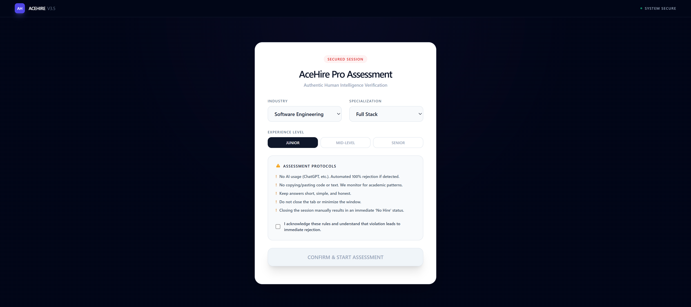
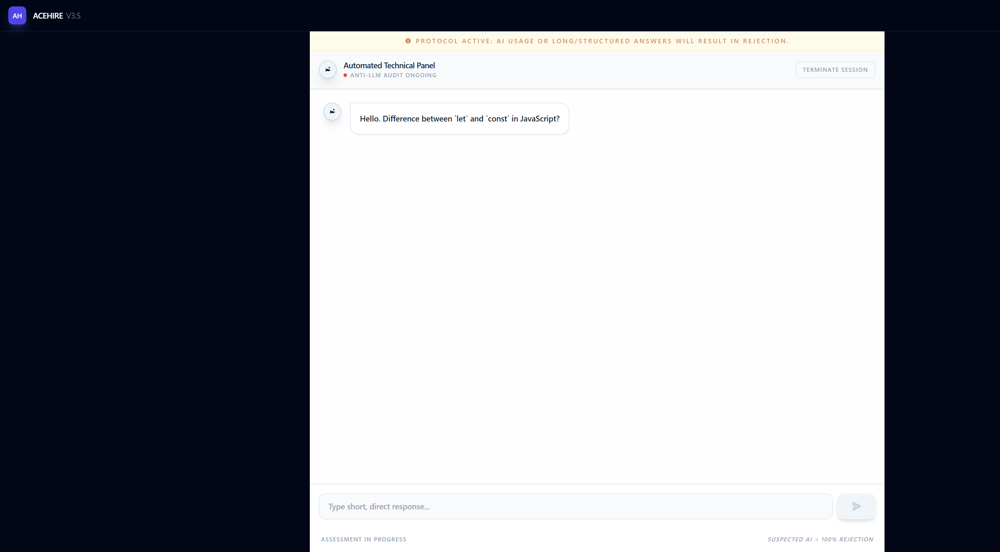
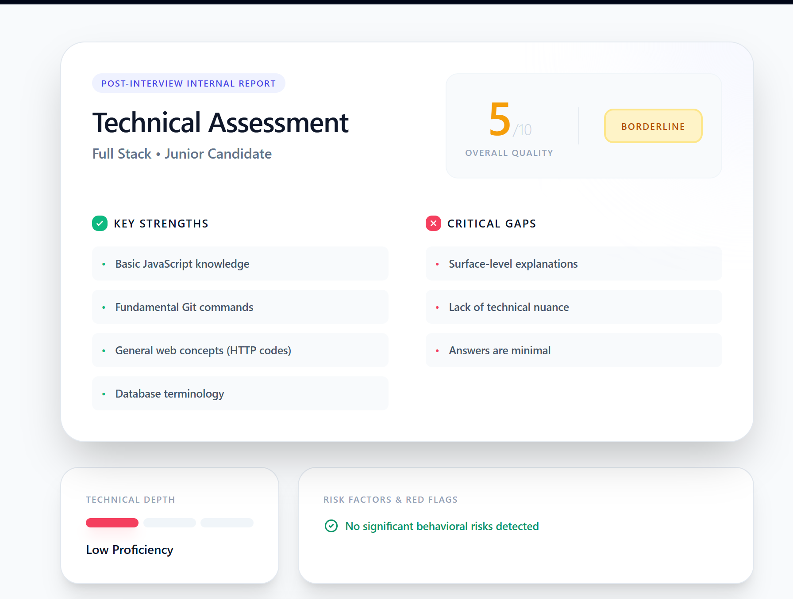
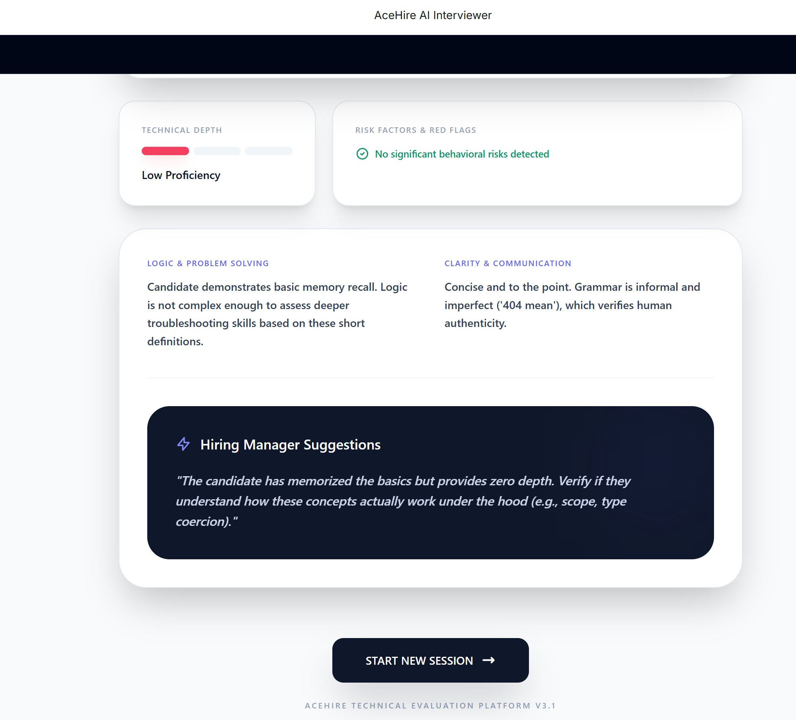

# AceHire

AceHire is an AI-powered interview platform that simulates **real-world job interviews** across multiple fields. It conducts structured, role-specific interviews and delivers **honest, realistic evaluation reports** to help candidates understand their true job readiness.

---

## 🚀 Features

- 🎯 Field-based interviews (Programming, IT, QA, WordPress, Accounting, and more)

- 🧑‍💻 Programming subfields (PHP, JavaScript, Python, etc.)

- 📈 Adaptive question difficulty based on answers

- 🧠 Realistic follow-up questions (no hints, no coaching)

- 📊 Detailed post-interview analysis and hiring recommendation

- 🏢 Professional interviewer tone and real hiring standards

---

## 🖼️ Screenshots

## Home Window



## Interview Window



## Reports Section 1



## Reports Section 2



---

## 🛠️ Run Locally

### Prerequisites

- Node.js installed

### Steps

1. Install dependencies  

   ```bash

   npm install
